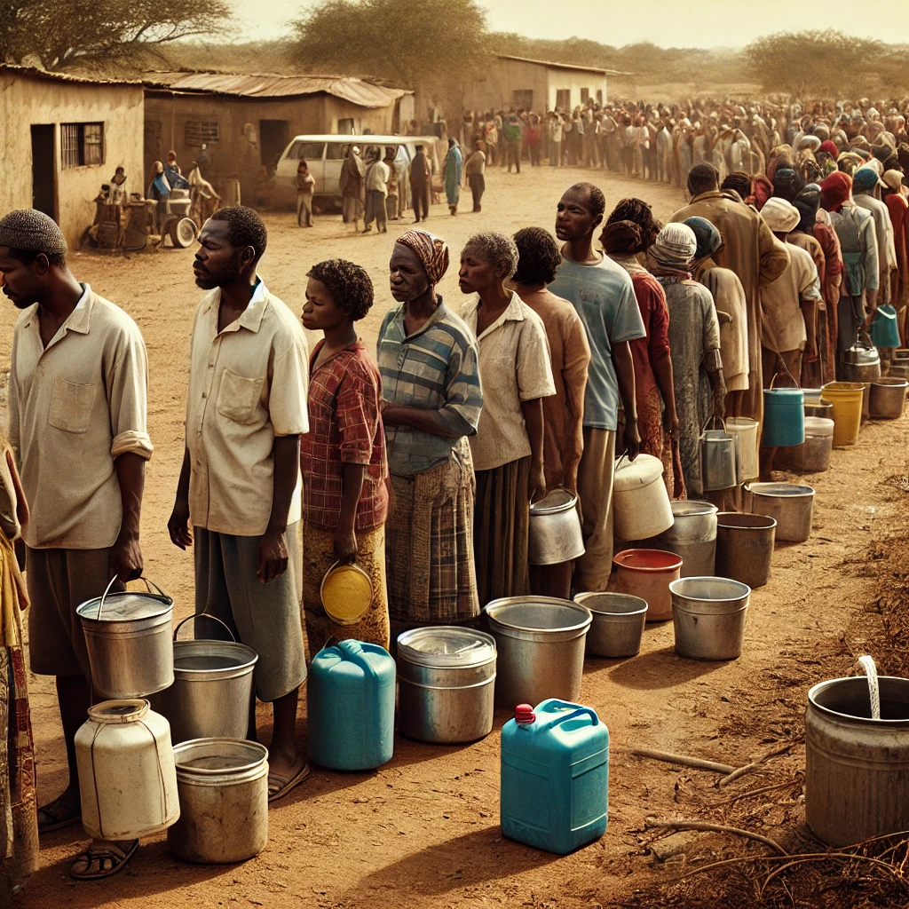

# Gender_Disparity_IN_Access_to_Water

## Introduction

This project explores gender parity in access to water and the challenges surrounding water collection in the fictional state of Maji Ndogo. In Maji Ndogo, water collection is a daily necessity, with residents frequently relying on various water sources during vulnerable early morning and late evening hours. This situation poses significant risks, particularly for women, who often bear the primary responsibility for water collection.

Our goal is to highlight the disparities between men and women in water access and to shed light on the risks and challenges they face. Through gender-specific data analysis, this project aims to inform better decision-making and encourage solutions for safer, more equitable access to water.

Key objectives of the project include:

- Visualizing queue compositions of men, women, and children over various days across different provinces to understand demographics accessing these vital resources.
- Utilizing Power BI to explore water usage patterns, highlighting gender distribution in queues at multiple water sources, including wells, rivers, and shared taps.
- Investigating environmental factors, specifically water source pollution across the provinces, to identify sources needing immediate attention and repair.
  
Additionally, the project will provide insights into the overall impact of water access challenges in Maji Ndogo, such as:

- Understanding the total number of people affected by water access issues.
- Assessing the financial requirements for necessary upgrades and identifying specific expenditure areas.
- Offering a comprehensive breakdown of spending by location and details on the utilization of funds.
- Forecasting whether the allocated budget will be sufficient for project completion and exploring potential areas for cost reduction.
- Presenting comprehensive data representation at national, provincial, and town levels to inform stakeholders about on-the-ground activities.

This repository acts as a central hub and summary point for the project on gender parity in access to water in the fictional state of Maji Ndogo. It provides an overview of the key themes and findings explored in three sub-projects, each of which is focused on a unique aspect of water access in the region.

These include:
- [Part 1 Visualizing Maji Ndogo's Past](https://github.com/lisaogeya/Part_1_Visualizing_Maji-Ndogo_Past)
- [Part 2 Visualizing the currents of change in Maji Ndogo](https://github.com/lisaogeya/Visualizing_the_currents_of_change_in_Maji_Ndogo)
- [Part 3 Transparency in tracking Maji Ndogo's water funds](https://github.com/lisaogeya/Part_3_Transparency_in_Tracking_Maji_Ndogo_funds)

By exploring the visualizations, demographic data, and funding details provided, stakeholders and researchers can gain a clearer understanding of the gender disparities in water access and the challenges faced by the community.

